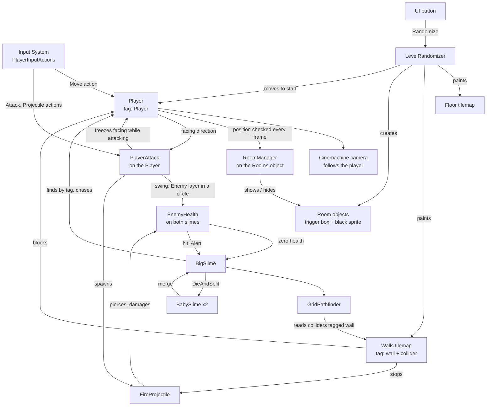

# Architecture

How the systems connect. Each system has its own note; this one is about the links between them. Back to [[Home]].

## The big picture

The [[Test Menu]] is left out of the picture because it touches almost everything: it spawns slimes, sets their health, changes the player's movement and attack settings, calls the randomizer and switches the room darkness off and on. It is a developer tool sitting beside the game, and nothing depends on it.

## The three contracts

Almost every link above rests on one of three conventions. Break one and several systems stop working at once.

1. **The `Player` tag.** [[Rooms and Darkness]] and the [[Slime Enemy]] both look the player up by tag when they start. There must be exactly one object with it, and it must exist before those scripts start.
2. **The `wall` tag.** The slime's line of sight and its [[Pathfinding]] treat any non-trigger collider tagged `wall` as solid, and the fireball stops at the same colliders ([[Combat]]). Hand-built scenes tag individual box colliders; the [[Level Randomizer]] tags its whole wall tilemap. An untagged wall still stops the player physically, but the slime will see and walk straight through it and fireballs will fly through it.
3. **The room object shape.** A room is a child of the object holding `RoomManager`, with a `BoxCollider2D` and a `SpriteRenderer`. Anything built that way, by hand or by the randomizer, is handled by the same manager.

Combat adds a fourth, smaller convention: **anything the player can hurt is on the `Enemy` layer and has an `EnemyHealth` component.** Both attacks find targets by the layer and damage them through that component.

## Who creates what

- **Scenes** place the long-lived objects: player, camera, grid and tilemaps, the `Rooms` parent, the UI.
- **The randomizer** owns everything that changes per level: tiles on both tilemaps and the room objects under `Rooms`. It clears and rebuilds all of it on every run.
- **Slimes** create each other: a big slime spawns two babies, and two babies spawn a big slime.
- **The player's attack** creates fireballs, its own hitbox marker, and, in a scene with no 2D light, one global light so the fireball's glow does not darken everything else ([[Combat]]).

## Update order

- `Update`: the player reads input and sets animation; `PlayerAttack` reads its two actions and recharges the spell; fireballs fly and check for hits; `RoomManager` checks rooms; baby slimes drift toward their partner and check whether they can merge.
- `FixedUpdate`: the player's body gets its velocity; the big slime runs its state machine and moves.
- UI events (the button) fire during `Update`, so a new level is fully built within one frame.
- While paused the time scale is 0: `FixedUpdate` stops entirely and `Update` keeps running. See [[Menus and Game Flow]].

## Rendering order

Sorting order decides what draws on top, lowest first:

| Order | What |
|---|---|
| -2 | Floor tilemap |
| -1 | Walls tilemap (walls and pillars) |
| 0 | Player, slimes |
| ±1 around the player | Fireball: behind the player when cast upward, in front otherwise |
| 10 | Room darkness |
| 100–101 | Melee hitbox debug circle (off by default; draws above darkness) |
| overlay | UI canvas, and the [[Test Menu]] window on top of that |

Darkness sits above characters on purpose: anything inside a dark room is hidden, including enemies.

## Where the code lives

All gameplay scripts are in the default assembly, with no namespaces and no shared base classes yet.

| Script | Location | System |
|---|---|---|
| `PlayerMovement.cs` | `Assets/Prefabs/Scripts/` | [[Player]] |
| `RoomsManager.cs` (class `RoomManager`) | `Assets/Prefabs/Scripts/` | [[Rooms and Darkness]] |
| `LevelRandomizer.cs` | `Assets/Prefabs/Scripts/` | [[Level Randomizer]] |
| `PlayerAttack.cs`, `FireProjectile.cs` | `Assets/Prefabs/Scripts/` | [[Combat]] |
| `EnemyHeatlh.cs` (class `EnemyHealth`) | `Assets/Prefabs/Enemies/Slime/Scripts/` | [[Combat]] |
| `BigSlime.cs`, `BabySlime.cs` | `Assets/Prefabs/Enemies/Slime/Scripts/` | [[Slime Enemy]] |
| `GridPathfinder.cs` | `Assets/Prefabs/Enemies/Slime/Scripts/` | [[Pathfinding]] |
| `MainMenu.cs`, `PauseMenu.cs`, `SettingsMenu.cs` | `Assets/Prefabs/Scripts/` | [[Menus and Game Flow]] |
| `TestMenu.cs` | `Assets/Prefabs/Scripts/` | [[Test Menu]] |

## Gaps in the architecture

These are the missing links that Week 2 and later work will add. Details in [[Roadmap]].

- **Damage flows one way.** The player can hurt slimes ([[Combat]]), but nothing connects the slime to the player.
- **Health is slime-specific.** `EnemyHealth` knows about `BigSlime` directly, so it cannot yet be reused for the player or a new enemy type.
- **Enemies and generated levels do not know about each other.** The randomizer does not spawn enemies, and a slime's pathfinder does not notice when the walls change. For now slimes get into a generated level only by hand, through the [[Test Menu]].
- **No game state.** The player has no health, and there is no death or win condition. Scene flow exists ([[Menus and Game Flow]]) but nothing in the game triggers it except the player's own menu choices.
