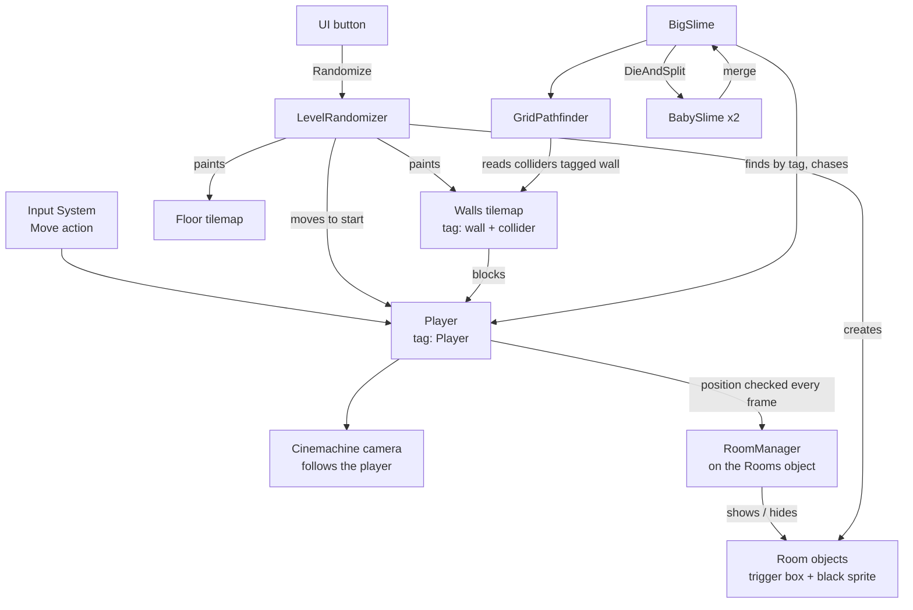

# Architecture

How the systems connect. Each system has its own note; this one is about the links between them. Back to [[Home]].

## The big picture

## The three contracts

Almost every link above rests on one of three conventions. Break one and several systems stop working at once.

1. **The `Player` tag.** [[Rooms and Darkness]] and the [[Slime Enemy]] both look the player up by tag when they start. There must be exactly one object with it, and it must exist before those scripts start.
2. **The `wall` tag.** The slime's line of sight and its [[Pathfinding]] treat any non-trigger collider tagged `wall` as solid. Hand-built scenes tag individual box colliders; the [[Level Randomizer]] tags its whole wall tilemap. An untagged wall still stops the player physically, but the slime will see and walk straight through it.
3. **The room object shape.** A room is a child of the object holding `RoomManager`, with a `BoxCollider2D` and a `SpriteRenderer`. Anything built that way, by hand or by the randomizer, is handled by the same manager.

## Who creates what

- **Scenes** place the long-lived objects: player, camera, grid and tilemaps, the `Rooms` parent, the UI.
- **The randomizer** owns everything that changes per level: tiles on both tilemaps and the room objects under `Rooms`. It clears and rebuilds all of it on every run.
- **Slimes** create each other: a big slime spawns two babies, and two babies spawn a big slime.

## Update order

- `Update`: the player reads input and sets animation; `RoomManager` checks rooms; baby slimes drift toward their partner.
- `FixedUpdate`: the player's body gets its velocity; the big slime runs its state machine and moves.
- UI events (the button) fire during `Update`, so a new level is fully built within one frame.
- While paused the time scale is 0: `FixedUpdate` stops entirely and `Update` keeps running. See [[Menus and Game Flow]].

## Rendering order

Sorting order decides what draws on top, lowest first:

| Order | What |
|---|---|
| -2 | Floor tilemap |
| -1 | Walls tilemap (walls and pillars) |
| 0 | Player, slimes |
| 10 | Room darkness |
| overlay | UI canvas |

Darkness sits above characters on purpose: anything inside a dark room is hidden, including enemies.

## Where the code lives

All gameplay scripts are in the default assembly, with no namespaces and no shared base classes yet.

| Script | Location | System |
|---|---|---|
| `PlayerMovement.cs` | `Assets/Prefabs/Scripts/` | [[Player]] |
| `RoomsManager.cs` (class `RoomManager`) | `Assets/Prefabs/Scripts/` | [[Rooms and Darkness]] |
| `LevelRandomizer.cs` | `Assets/Prefabs/Scripts/` | [[Level Randomizer]] |
| `BigSlime.cs`, `BabySlime.cs` | `Assets/Prefabs/Enemies/Slime/Scripts/` | [[Slime Enemy]] |
| `GridPathfinder.cs` | `Assets/Prefabs/Enemies/Slime/Scripts/` | [[Pathfinding]] |
| `MainMenu.cs`, `PauseMenu.cs`, `SettingsMenu.cs` | `Assets/Prefabs/Scripts/` | [[Menus and Game Flow]] |

## Gaps in the architecture

These are the missing links that Week 2 and later work will add. Details in [[Roadmap]].

- **No damage path.** Nothing connects the player to `BigSlime.DieAndSplit()` or `BabySlime.TakeDamage()`, and nothing connects the slime to the player.
- **Enemies and generated levels do not know about each other.** The randomizer does not spawn enemies, and a slime's pathfinder does not notice when the walls change.
- **No game state.** There is no health, death or win condition. Scene flow exists ([[Menus and Game Flow]]) but nothing in the game triggers it except the player's own menu choices.
