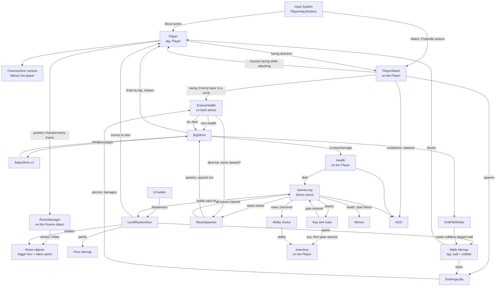

# Architecture

How the systems connect. Each system has its own note; this one is about the links between them. Back to [[Home]].

## The big picture

The [[Test Menu]] is left out of the picture because it touches almost everything: it spawns slimes, sets their health, changes the player's movement and attack settings, calls the randomizer and switches the room darkness off and on. It is a developer tool sitting beside the game, and nothing depends on it.

## The three contracts

Almost every link above rests on one of three conventions. Break one and several systems stop working at once.

1. **The `Player` tag.** [[Rooms and Darkness]] and the [[Slime Enemy]] both look the player up by tag when they start. There must be exactly one object with it, and it must exist before those scripts start.
2. **The `wall` tag.** The slime's line of sight and its [[Pathfinding]] treat any non-trigger collider tagged `wall` as solid, and the fireball stops at the same colliders ([[Combat]]). Hand-built scenes tag individual box colliders; the [[Level Randomizer]] tags its whole wall tilemap. An untagged wall still stops the player physically, but the slime will see and walk straight through it and fireballs will fly through it.
3. **The room object shape.** A room is a child of the object holding `RoomManager`, with a `BoxCollider2D` and a `SpriteRenderer`. Anything built that way, by hand or by the randomizer, is handled by the same manager.

Combat adds a fourth, smaller convention: **anything the player can hurt is on the `Enemy` layer and has `Health` plus `EnemyHealth`.** Both attacks find targets by the layer and damage them through `EnemyHealth`. The player is on its own `Player` layer, and the `Player` and `Enemy` layers do not collide, so enemies hurt the player by overlap checks, never by pushing ([[Slime Enemy]]).

## Who creates what

- **Scenes** place the long-lived objects: player, camera, grid and tilemaps, the `Rooms` parent, the UI.
- **The randomizer** owns everything that changes per level: tiles on both tilemaps and the room objects under `Rooms`. It clears and rebuilds all of it on every run.
- **Slimes** create each other: a big slime spawns two babies, and two babies spawn a big slime.
- **The game loop** (Demo scene only) creates everything that belongs to one level of a run: it asks the randomizer for the layout, the wave spawner for the enemies, and places the key and the gate. It removes all of it before building the next level ([[Game Loop]]).
- **The player's attack** creates fireballs, its own hitbox marker, and, in a scene with no 2D light, one global light so the fireball's glow does not darken everything else ([[Combat]]).

## Update order

- `Update`: the player reads input and sets animation; `PlayerAttack` reads its two actions and recharges the spell; fireballs fly and check for hits; `RoomManager` checks rooms; baby slimes drift toward their partner and check whether they can merge.
- `FixedUpdate`: the player's body gets its velocity; the big slime runs its state machine and moves.
- UI events (the button) fire during `Update`, so a new level is fully built within one frame.
- While paused the time scale is 0: `FixedUpdate` stops entirely and `Update` keeps running. See [[Menus and Game Flow]].

## Rendering order

Sorting order decides what draws on top, lowest first:

| Order | What |
|---|---|
| -2 | Floor tilemap |
| -1 | Walls tilemap (walls and pillars) |
| 0 | Player, slimes |
| ±1 around the player | Fireball: behind the player when cast upward, in front otherwise |
| 10 | Room darkness |
| 100–101 | Melee hitbox debug circle (off by default; draws above darkness) |
| overlay | UI canvas, and the [[Test Menu]] window on top of that |

Darkness sits above characters on purpose: anything inside a dark room is hidden, including enemies.

## Where the code lives

All gameplay scripts are in the default assembly, with no namespaces. `Ability` is the only shared base class so far.

| Script | Location | System |
|---|---|---|
| `PlayerMovement.cs` | `Assets/Prefabs/Scripts/` | [[Player]] |
| `RoomsManager.cs` (class `RoomManager`) | `Assets/Prefabs/Scripts/` | [[Rooms and Darkness]] |
| `LevelRandomizer.cs` | `Assets/Prefabs/Scripts/` | [[Level Randomizer]] |
| `PlayerAttack.cs`, `FireProjectile.cs` | `Assets/Prefabs/Scripts/` | [[Combat]] |
| `EnemyHeatlh.cs` (class `EnemyHealth`) | `Assets/Prefabs/Enemies/Slime/Scripts/` | [[Combat]] |
| `BigSlime.cs`, `BabySlime.cs` | `Assets/Prefabs/Enemies/Slime/Scripts/` | [[Slime Enemy]] |
| `GridPathfinder.cs` | `Assets/Prefabs/Enemies/Slime/Scripts/` | [[Pathfinding]] |
| `MainMenu.cs`, `PauseMenu.cs`, `SettingsMenu.cs` | `Assets/Prefabs/Scripts/` | [[Menus and Game Flow]] |
| `Health.cs`, `PlayerHurtFlash.cs` | `Assets/Prefabs/Scripts/` | [[Combat]], [[Player]] |
| `ContactDamage.cs` | `Assets/Prefabs/Enemies/Slime/Scripts/` | [[Slime Enemy]] |
| `GameLoop.cs`, `WaveSpawner.cs`, `LevelGraph.cs`, `KeyPickup.cs`, `Gate.cs`, `AbilityChoiceScreen.cs`, `LoopHud.cs` | `Assets/Prefabs/Scripts/` | [[Game Loop]] |
| `Inventory.cs`; `Ability.cs`, `AbilityPool.cs` and the four abilities | `Assets/Prefabs/Scripts/`; `Assets/Prefabs/Abilities/` | [[Inventory and Abilities]] |
| `HealthLabel.cs`, `AttackCorner.cs` | `Assets/Prefabs/Scripts/` | [[HUD]] |
| `TestMenu.cs` | `Assets/Prefabs/Scripts/` | [[Test Menu]] |
| Unit tests and `TestRunLogger` | `Assets/Tests/Editor/` | EditMode tests, run from the Test Runner window |

## Gaps in the architecture

These are the links still missing. Details in [[Roadmap]].

- **Enemies don't belong to rooms.** Waves spawn anywhere in the level and chase at once. Enemies placed per room that wake when the room is entered would need the room system and the spawner to talk ([[Rooms and Darkness]]).
- **A slime's pathfinder never forgets walls.** The game loop avoids the problem by removing every enemy before building a new level; anything that keeps enemies alive through a rebuild would hit it ([[Pathfinding]]).
- **One art set.** The randomizer has a single list of tiles; per-level asset packs need it to take a tile set per build ([[Level Randomizer]]).
- **No end to a run.** The loop repeats until death; there is no win condition or score yet ([[Game Loop]]).
