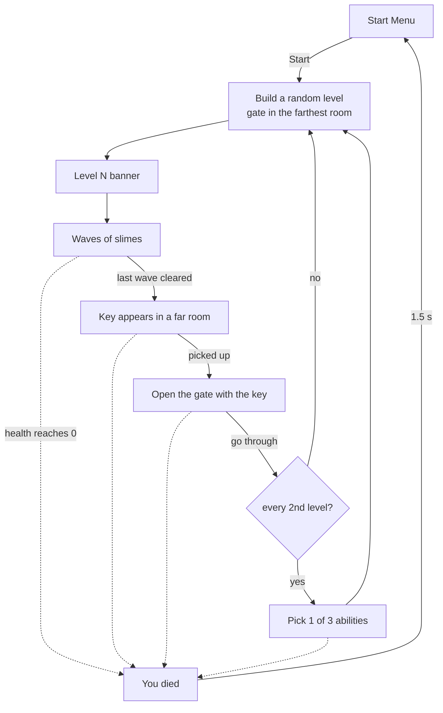

# Game Loop

The run as a player plays it: a random level, waves of enemies, a key, a gate, the next random level, and death back to the menu. Part of the [[Architecture]]; back to [[Home]].

**Files:** `Assets/Prefabs/Scripts/GameLoop.cs`, `WaveSpawner.cs`, `KeyPickup.cs`, `Gate.cs`, `LoopHud.cs`, `AbilityChoiceScreen.cs`; prefabs `Assets/Prefabs/Key.prefab`, `Gate.prefab`, `UI/Loop HUD.prefab`, `UI/Ability Choice.prefab`; placeholder sprites in `Assets/Art/Placeholders/`; scene `Assets/Scenes/Demo.unity`

Built on 5 Oct 2026. The design and its reasons are in `docs/superpowers/specs/2026-10-05-demo-game-loop-design.md`.

## The loop

There is no last level yet: the loop repeats until the player dies. Each level uses the Catacombs art for now. Different art per level is planned once more asset packs exist; the [[Level Randomizer]] would get a different set of tiles per level.

## GameLoop

`GameLoop` (one per Demo scene, on the `Game Loop` object next to the `WaveSpawner`) runs a small state machine:

| State | What is happening | Leaves when |
|---|---|---|
| Starting | Old level cleared, new one built, banner showing | the banner ends → Fighting |
| Fighting | Waves are coming | the last wave is cleared → KeyHunt |
| KeyHunt | The key is somewhere in the level | the gate is opened with it → GateOpen |
| GateOpen | The gate is open | the player goes through → Choosing or Starting |
| Choosing | Ability choice screen, game frozen | a card is picked → Starting |
| Dead | "You died", game frozen | never; the menu loads |

Every change in normal play goes through one table (`GameLoop.Transition`) that lists the allowed moves. The only exception is the Test Menu's "offer abilities now", which steps into Choosing and back to where it was. Anything not in the table is ignored, and nothing leaves Dead. That is what makes "the player dies while the choice screen is open" or "dies on the frame the gate opens" safe: death always wins, and no level is built after it.

**Building a level.** First everything from the last level is removed: enemies, key and gate. Old enemies would otherwise end up inside the new walls, and their pathfinders would remember the old ones ([[Pathfinding]]). Then the randomizer builds a new level and puts the player in the start room. The gate goes in the room the most doors away from the start, so the whole level lies between them. A "Level N" banner shows for two seconds before the first wave.

**The key** appears once the last wave is cleared. It goes in a random room among the farther half of the rooms, measured from the room the player is standing in, and never on the gate. In a level with a single room it goes in that room, away from the player. As a last resort it appears at the player's feet, so the loop can never get stuck without a key.

**Guards for the Test Menu.** Forcing the gate open only works while a level is being played (Fighting or KeyHunt). Opened during the banner, the loop would ignore it and the gate would never let the player through. If the last wave ends while a test choice has the game frozen, the key is still handed out once the choice is made.

**Ability choices.** After every second level (`abilityEveryNLevels`), going through the gate opens the choice screen before the next level is built. See [[Inventory and Abilities]] for how the cards are drawn.

**Death.** When the player's health reaches zero, the game freezes and "You died" shows for 1.5 real seconds. Then the Start Menu loads for a new run. The time scale is always set back to normal before the menu loads, and again if the loop is destroyed, so the menu never starts frozen ([[Menus and Game Flow]]).

**The pause menu** ignores Escape while the choice screen or the death screen is up. Both freeze the game themselves, and pausing over them would let Resume unfreeze a screen that should stay put.

## The choice screen

`AbilityChoiceScreen` freezes the game and shows the cards side by side, each with the ability's name and one-line description. The first card is selected when it opens, so a gamepad can move between cards and confirm straight away. Picking a card closes the screen, unfreezes the game and hands the ability to the inventory. It builds its cards fresh each time it opens.

## Waves

`WaveSpawner` sends the enemies of a level in waves.

**How many.** The number of waves and the number of enemies per wave both grow with the level number, each up to a cap. Level 1 has two waves of three slimes; later levels have more and bigger waves. All the numbers are fields on the component and sliders in the [[Test Menu]].

**Where they appear.** Each enemy gets a random free spot on the floor of a random room ([[Level Randomizer]]). A spot is refused when:

- it is too close to the player, so nothing appears on top of them,
- it is too close to another living enemy, so enemies don't stack,
- too many enemies are already within a set radius, so no single area gets crowded.

A refused spot is retried a limited number of times. When nothing fits (a tiny level, or very strict spacing), that enemy is skipped and the wave comes up short. A wave that spawns nobody counts as cleared at once, so the loop can never stall on spawning.

**Waking up.** New slimes are told to chase straight away ([[Slime Enemy]]), so they come to the player through the dark rooms instead of patrolling. This happens one frame after they appear, because a slime ignores the order until it has finished setting itself up.

**When a wave is over.** When no enemy is alive, counting babies, using the shared list of living enemies ([[Combat]]). The check runs every frame rather than reacting to deaths. A big slime splitting or two babies merging therefore never ends a wave early, because the list never drops to zero during either. After a short breather the next wave starts. After the last wave the spawner reports that the level's waves are done.

**Verified on 5 Oct 2026** in `testing the new thing`, with a spawner added for the test:

- Level 1 gave two waves of three. Every slime spawned at least 8 units from the player, and no two closer than the minimum spacing.
- Wave 2 started two seconds after wave 1 was cleared, and clearing it reported the waves as done.
- With an impossible distance to the player, both waves spawned nobody, counted as cleared, and the waves finished without errors.

## Key and gate

**The key** is a hollow red square, a placeholder until there is art. Touching it puts a key in the player's inventory ([[Inventory and Abilities]]), and the key disappears.

**The gate** is a 2×2 square: dark while closed, light once open. Walking into it:

- **closed, with a key:** the key is used up and the gate opens;
- **closed, without a key:** the gate reports that a key is needed, which the HUD can show;
- **open:** going through finishes the level.

Opening and going through are two separate steps. Standing in the gate only counts as going through once it has been open for a moment (a third of a second). The player is usually still inside the gate when it opens, so standing there, not only stepping in, counts.

Both sit at the same drawing level as the characters, under the room darkness. So they are hidden until the player enters their room ([[Rooms and Darkness]]), which is what makes the key something to find.

**Verified on 5 Oct 2026** in `testing the new thing`: the closed gate without a key asked for one; touching the key gave one key; walking back in opened the gate and used the key; going through was reported 0.3 s later.

In the [[Test Menu]], the Inventory section can place a key or a gate in front of the player.

## The loop's HUD

`LoopHud` adds the loop's information to the [[HUD]]:

- **Top centre:** "Level 3 · Wave 2/4" (the wave part only while fighting), and below it what to do now: *Survive*, *Next wave in 2s*, *Find the key*, *Go to the gate*, *Go through the gate*. For two seconds after walking into a closed gate without a key it says *Need a key*, in red.
- **Top right:** the inventory, read every frame: the word "Key" while one is held (there is no key icon yet), and the abilities picked so far with their stacks.
- **Centre:** the "Level N" banner, and the "You died" screen.

Its texts are built as soon as it exists (in `Awake`), because the game loop shows the first banner when it starts, and Unity does not promise which of the two starts first.

## The Demo scene

`Demo` is where the game itself is tested, as a player would play it. It is a copy of `testing the new thing` with the Randomize button removed, building on start switched off (the loop builds the levels) and no level saved in it. The `Game Loop` object and the loop's HUD and choice screen are added. The Start button of the menu loads it. See [[Scenes and Assets]] for the role of each scene.

## Verified in Play mode (5 Oct 2026)

In `Demo`, with god mode on until the death check:

- Level 1 built 5 rooms with the gate in the farthest one. The banner showed for 2 s, then wave 1 of 2 began. The first slime reached the player within a few seconds.
- After both waves the key appeared in room 3 while the player was in room 0, 30 units away. The objective changed to *Find the key*.
- Picking up the key, then entering the gate: it opened, the player went through, and level 2 was built with a different layout. There was no choice screen after level 1.
- After level 2 the choice screen showed three different cards, froze the game and blocked the pause menu. Picking Vitality gave 12/12 health and built level 3.
- Opening a choice and dying while it was open: death won, the screen closed and no level was built. "You died" showed, then the Start Menu loaded at normal speed.
- Pressing Start in the menu began a fresh run: level 1, full health, empty inventory.

**Not tested by the checks above:** a real Escape key press during the choice screen (only the blocking flag was checked), choosing a card with a gamepad, and how the waves and damage feel to play.

## How it can progress

- Different asset packs per level, chosen when the level is built.
- A goal or an end to a run, and a score or a record of how far a run went.
- Enemies placed per room by the level itself, waking when their room is entered ([[Rooms and Darkness]]).
- A proper gate and key from the art pack.
