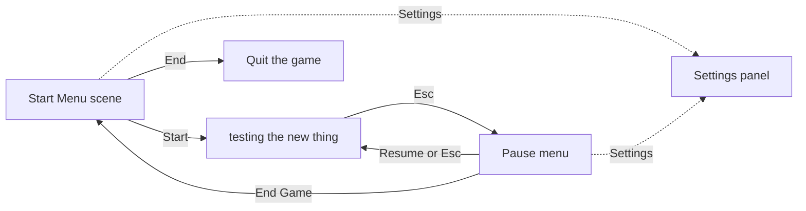

# Menus and Game Flow

The start menu, the pause menu, the shared settings panel, and how the game moves between scenes. Part of the [[Architecture]]; back to [[Home]].

**Files:** `Assets/Prefabs/Scripts/MainMenu.cs`, `PauseMenu.cs`, `SettingsMenu.cs`, `Assets/Prefabs/UI/Settings Panel.prefab`, scene `Assets/Scenes/Start Menu.unity`

## The flow



Scenes are loaded by name, so both must be in the Build Settings scene list. `Start Menu` is first in that list, which makes it the scene a built game opens with.

## Start menu

```
Backdrop          a copy of a generated level's tilemaps (no colliders, no scripts)
Main Camera
Canvas            MainMenu
├── Background Dim     darkens the backdrop so the menu reads clearly
├── Menu               title + Start / Settings / End, anchored to the left middle
└── Settings Panel     prefab instance, hidden
EventSystem
```

- **Start** loads the game scene.
- **Settings** opens the settings panel.
- **End** quits. Inside the editor it stops Play mode instead, because quitting does nothing there.

The backdrop is a static copy, not a live generator. It will not change when the [[Level Randomizer]] changes.

## Pause menu

`PauseMenu` sits on the game scene's Canvas, which is always active; the menu itself starts hidden.

Pressing Escape:

1. If the game is running: set the time scale to 0, then show the menu.
2. If the settings panel is open: close it and go back to the pause options.
3. Otherwise: hide the menu and set the time scale back to 1.

**What pausing actually stops.** Time scale 0 stops physics and everything that uses scaled time: the player's body, the slime, animations. `Update` still runs, which is why the Escape check keeps working. The [[Player]] script skips its `Update` while paused so the character cannot be turned on the spot.

**End Game** loads the Start Menu. Time scale survives scene changes, so `PauseMenu` resets it to 1 when it is destroyed; without that the menu scene would start frozen.

## Settings panel

One prefab used by both menus, so a new setting only has to be added once.

- **Volume** sets the global audio volume and saves it. The saved value is applied when the game launches, before any menu is opened.
- **Fullscreen** switches the window mode. It has no visible effect inside the editor.
- **Back** closes the panel.

The panel has a `returnTo` reference: the object it hides while open and shows again when closed. Each scene sets it on its own instance (the menu column in the start scene, the pause options in the game scene). This is the only thing that differs between the two uses.

## Links to other systems

- Start loads the scene built by the [[Level Randomizer]]. That scene keeps its saved level, so every run currently starts in the same layout until the Randomize button is pressed.
- Pausing freezes the [[Player]] and the [[Slime Enemy]] through the time scale; neither needs pause code of its own beyond the player's one-line guard.
- UI is drawn above everything, including room darkness ([[Rooms and Darkness]]).

## How it can progress

- **New level per run:** have Start generate a fresh level instead of loading the saved one.
- **Player death** (Week 2) can reuse this flow: show a "You died" panel with the same End Game button. See [[Roadmap]].
- **More settings:** separate music and effects volume once audio exists, key rebinding, resolution.
- **Gamepad:** the menus can already be navigated with a stick, but nothing selects the first button when a menu opens, and only Escape opens the pause menu.
- **Art pass:** the title is the project name in the default font, and buttons use Unity's built-in sprite.
