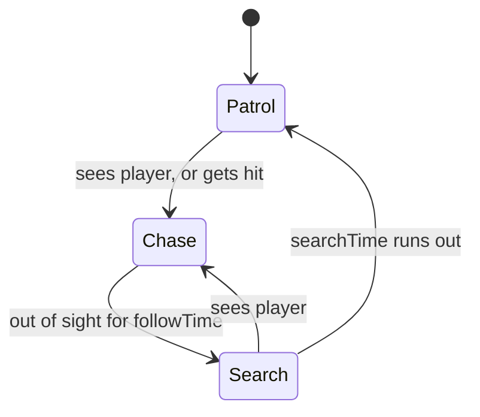

# Slime Enemy

A big slime that hunts the player, and the baby slimes it splits into. Part of the [[Architecture]]; back to [[Home]].

**Files:** `Assets/Prefabs/Enemies/Slime/` — `BigSlime.prefab`, `BabySlime.prefab`, `Scripts/BigSlime.cs`, `Scripts/BabySlime.cs`, `Scripts/EnemyHeatlh.cs` (class `EnemyHealth`, described in [[Combat]]), plus their sprites and animators

## Big slime

A kinematic body on the `Enemy` layer, moved by script. It runs a three-state machine in `FixedUpdate`:

**Patrol.** Picks a random walkable spot within `patrolRadius` of where it spawned, walks there, then waits a moment while glancing in random directions.

**Chase.** Walks toward the player and stops at `stopDistance`. While chasing it is locked on: the vision cone no longer matters, only range and walls. For a short time after losing sight it still tracks the player's real position, so it follows around a corner instead of stopping at it.

**Search.** Walks to where the player was last seen, looks around for `searchTime`, then goes back to patrolling.

**Getting hit.** A hit that does not kill it calls `Alert()`: the slime turns toward the player and starts chasing from any state, even if it was hit from behind or never saw them.

### Sight

The slime sees the player when three things are true: the player is within range, inside the vision cone around the direction the slime is facing, and no collider tagged `wall` lies on the line between them. Spotting uses the shorter `detectionRange`; staying locked on uses the longer `losePlayerRange`.

### Movement

`MoveTowards` goes straight at the target when the way is clear. When a wall is in the way it asks the [[Pathfinding]] for a route and follows it, recalculating every `repathInterval`. Because the body is kinematic, walls do not physically stop it; staying out of walls is entirely the pathfinder's job.

The hop animation only plays while the slime is actually moving. Standing still freezes it on the first frame.

Selecting a slime in the editor draws its ranges, vision cone, patrol area and current path.

## Splitting and merging

Both prefabs carry an `EnemyHealth` component ([[Combat]]). The big slime takes a couple of hits; a baby dies in one.

- When the big slime's health runs out, `EnemyHealth` calls `BigSlime.DieAndSplit()`, which spawns two baby slimes side by side, links them as partners and destroys the big slime.
- Each `BabySlime` drifts toward its partner. After `fuseDelay` seconds, touching the partner spawns a new big slime and destroys both babies. A guard makes sure only one of the two triggers the merge.
- The babies check for the overlap themselves every frame. Both are kinematic bodies, and Unity does not send trigger messages between two kinematic bodies, so the original trigger callbacks never fired. Those callbacks are still in the script but do nothing in practice.
- A baby whose health runs out is destroyed. A baby with no partner just stays where it is.

The intended fight: kill the big slime, then kill at least one baby before the pair reunites. The babies are slow and the merge delay is short, so the window is about a second. This loop was played through in Play mode on 2 Oct 2026.

## What is missing

- **The slime cannot hurt the player.** Chase ends with it standing next to them.
- **The slime shoves the player.** Its body is a solid kinematic collider wider than `stopDistance`, so a chasing slime pushes the player along instead of stopping. Seen in the 2 Oct play test, where a player standing still was carried several units.
- **Baby slimes ignore walls.** They move by setting their position directly.
- **A merged big slime starts fresh:** full health, new patrol home, no memory of the player.
- **Unused baby health.** `BabySlime` keeps its own `maxHealth` and `TakeDamage()` from before `EnemyHealth` existed; nothing calls them.

## Links to other systems

- Finds the [[Player]] by tag.
- Depends on the `wall` tag for both sight and [[Pathfinding]].
- Not yet placed in generated levels by the level itself; see the limit noted in [[Level Randomizer]]. Slimes can be spawned into one by hand, with any health, from the [[Test Menu]].
- Will be hidden automatically inside dark rooms, since darkness draws above characters ([[Rooms and Darkness]]).

## How it can progress

- **Contact damage** is the remaining Week 2 work on the slime's side: hurt the player on a timer when the chase reaches them, with a knockback ([[Roadmap]]).
- **Reuse the brain.** Patrol, chase and search are not slime-specific. Pulling them into a base enemy class would let new enemy types change only speed, sight and attack.
- **Babies that path** using the same pathfinder instead of drifting through walls.
- **Room awareness:** stay idle until the player enters the slime's room.
