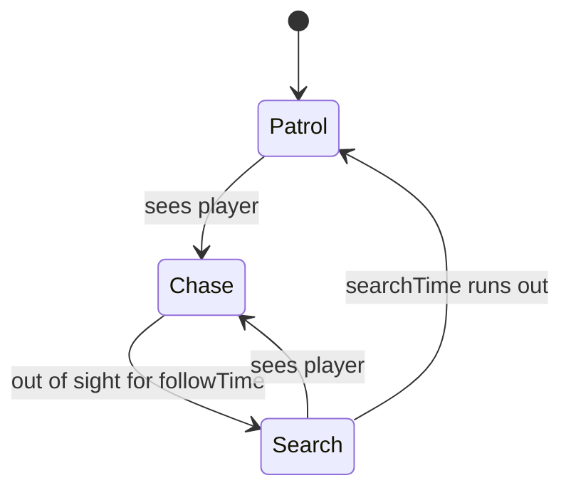

# Slime Enemy

A big slime that hunts the player, and the baby slimes it splits into. Part of the [[Architecture]]; back to [[Home]].

**Files:** `Assets/Prefabs/Enemies/Slime/` — `BigSlime.prefab`, `BabySlime.prefab`, `Scripts/BigSlime.cs`, `Scripts/BabySlime.cs`, plus their sprites and animators

## Big slime

A kinematic body on the `Enemy` layer, moved by script. It runs a three-state machine in `FixedUpdate`:

**Patrol.** Picks a random walkable spot within `patrolRadius` of where it spawned, walks there, then waits a moment while glancing in random directions.

**Chase.** Walks toward the player and stops at `stopDistance`. While chasing it is locked on: the vision cone no longer matters, only range and walls. For a short time after losing sight it still tracks the player's real position, so it follows around a corner instead of stopping at it.

**Search.** Walks to where the player was last seen, looks around for `searchTime`, then goes back to patrolling.

### Sight

The slime sees the player when three things are true: the player is within range, inside the vision cone around the direction the slime is facing, and no collider tagged `wall` lies on the line between them. Spotting uses the shorter `detectionRange`; staying locked on uses the longer `losePlayerRange`.

### Movement

`MoveTowards` goes straight at the target when the way is clear. When a wall is in the way it asks the [[Pathfinding]] for a route and follows it, recalculating every `repathInterval`. Because the body is kinematic, walls do not physically stop it; staying out of walls is entirely the pathfinder's job.

The hop animation only plays while the slime is actually moving. Standing still freezes it on the first frame.

Selecting a slime in the editor draws its ranges, vision cone, patrol area and current path.

## Splitting and merging

- `BigSlime.DieAndSplit()` spawns two baby slimes side by side, links them as partners and destroys the big slime.
- Each `BabySlime` drifts toward its partner. After `fuseDelay` seconds, touching the partner spawns a new big slime and destroys both babies. A guard makes sure only one of the two triggers the merge.
- `BabySlime.TakeDamage()` destroys a baby at zero health. A baby with no partner just stays where it is.

The intended fight: kill the big slime, then kill at least one baby before the pair reunites.

## What is missing

- **Nothing calls `DieAndSplit()` or `TakeDamage()`.** There is no player attack, so the split and merge never happen in play.
- **The slime cannot hurt the player.** Chase ends with it standing next to them.
- **`BabySlime.prefab` has a missing script.** It references an `EnemyHealth` component that was never added to the project. The saved values on it (max health, a hit flash colour and flash time) show what it was meant to do.
- **Baby slimes ignore walls.** They move by setting their position directly.
- **A merged big slime starts fresh:** new patrol home, no memory of the player.

## Links to other systems

- Finds the [[Player]] by tag.
- Depends on the `wall` tag for both sight and [[Pathfinding]].
- Not yet placed in generated levels; see the limit noted in [[Level Randomizer]].
- Will be hidden automatically inside dark rooms, since darkness draws above characters ([[Rooms and Darkness]]).

## How it can progress

- **Combat hooks** are the Week 2 work: a shared health component, contact damage, and the player's attack calling into the existing split logic ([[Roadmap]]).
- **Reuse the brain.** Patrol, chase and search are not slime-specific. Pulling them into a base enemy class would let new enemy types change only speed, sight and attack.
- **Babies that path** using the same pathfinder instead of drifting through walls.
- **Room awareness:** stay idle until the player enters the slime's room.
